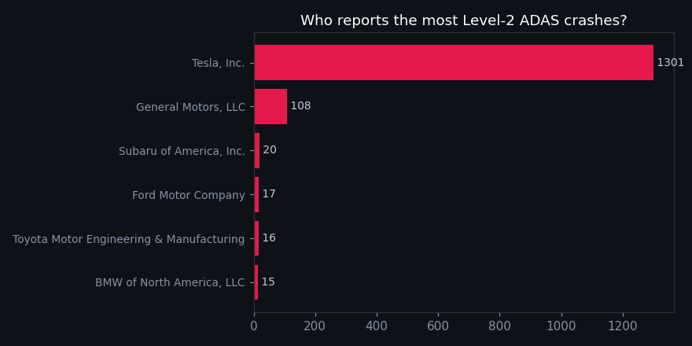
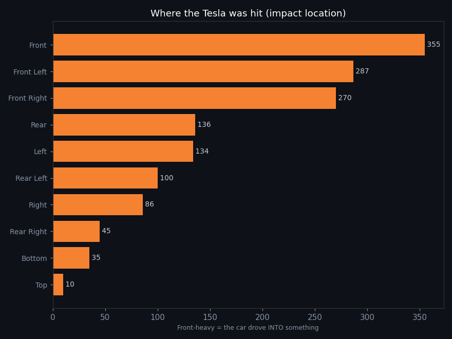
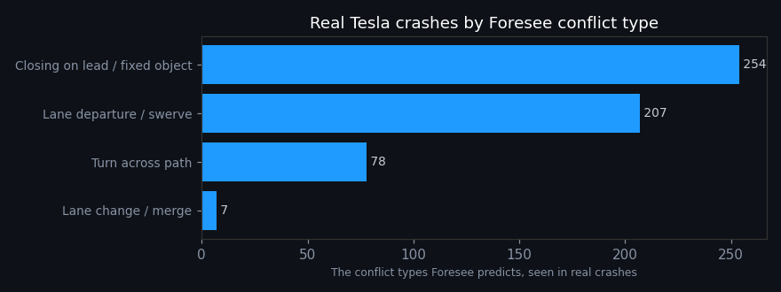
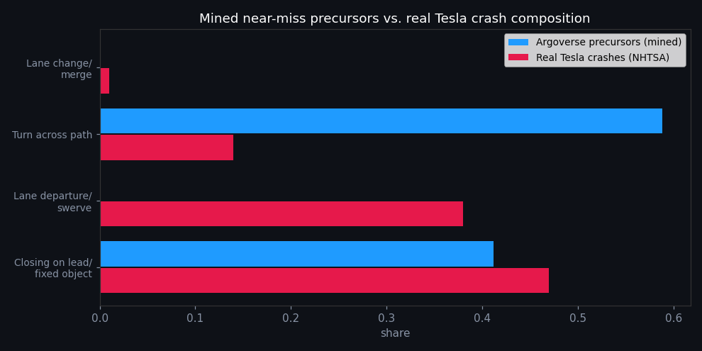

# Real-World Insight: What Actually Goes Wrong in Tesla Driver-Assist Crashes

> Forecasting trajectories is commoditised - every AV company does it. The harder, more valuable
> skill is turning **real, messy, public** autonomous-vehicle data into usable insight. This is
> that half of the project: a rigorous read of every Level-2 (ADAS) crash U.S. manufacturers are
> *legally required* to report to NHTSA - a dataset **Tesla dominates** - and a direct connection
> back to the conflict types Foresee predicts.
>
> Reproduce: `python analysis/nhtsa_insights.py` (downloads the data, writes
> [`assets/insights/`](assets/insights/)).

## The data
NHTSA's **Standing General Order (SGO)** requires manufacturers to report ADAS crashes. Current
public snapshot: **1,536 Level-2 crash reports**, of which **1,295 (84%) are Tesla** - the closest
thing to a public Tesla crash dataset. Every Tesla row is **"engaged at crash"** (the driver-assist
system was on).

## Headline findings (Tesla subset)

1. **Tesla files 84% of all Level-2 ADAS crash reports** - far more than every other manufacturer
   combined. (Partly fleet size + aggressive telematics reporting - see caveats - but still the
   single richest window into real driver-assist crashes.)
2. **The system was the *striking* vehicle in ~76% of cases.** Impact location is overwhelmingly
   **front / front-left / front-right (912)** vs **rear (281)** - i.e. the car drove *into*
   something far more often than it was hit. This is the opposite of a typical human rear-end
   profile and points at a *forward-perception/planning* failure mode.
3. **Lane / Road Departure is the #2 pre-crash movement (207).** The car leaving its lane or the
   road is a signature failure, second only to going straight into a lead vehicle or fixed object.
4. **12 fatalities** in this snapshot, concentrated on **highways**; median pre-crash speed
   **35 mph** (90th percentile **71 mph**).

## The loop closes - real crashes map onto Foresee's conflict taxonomy

Mapping each crash's pre-crash movement onto the **same conflict taxonomy Foresee predicts**
([`foresee.risk`](src/foresee/risk.py)) shows the model is targeting the *right* failure modes:

| Foresee conflict type | Real Tesla crashes | Share of classifiable |
|---|---:|---:|
| **Closing on lead / fixed object** | 254 | **47%** |
| **Lane departure / swerve** | 207 | **38%** |
| **Turn across path** | 78 | 14% |
| Lane change / merge | 7 | 1% |

**85% of real, classifiable Tesla driver-assist crashes are exactly the two patterns Foresee's
risk logic flags** - *closing on a lead/fixed object* and *lane departure/swerve*. That is the
payoff of the whole project: the conflict taxonomy isn't arbitrary - it's where the real crashes
are. It also tells us where to spend effort (forward-closing and lane-departure detection matter
far more than lane-change/merge).

## Caveats

- **Tesla redacts 100% of crash narratives and the ODD field as confidential business
  information.** Free-text NLP is therefore impossible for Tesla - this analysis uses only the
  **non-redacted structured fields**. (This is itself a finding: Tesla discloses far less than the
  schema allows.)
- **High "Unknown" rates.** Many fields are largely unknown (e.g. ~56% of pre-crash movements,
  ~54% of crash partners). Every percentage above is computed **over known values only**, with the
  unknown share reported in each figure; the conflict-taxonomy shares are "of classifiable crashes."
- **No exposure denominator.** SGO has no miles-driven, so this measures crash **composition**, not
  **rate**. "84% of reports" != "84% of danger" - it reflects reporting behaviour and fleet size.
- **"Engaged" != FSD.** It includes basic Autopilot (lane-keep/TACC), which is very widely used; the
  data can't cleanly isolate Full Self-Driving.
- **Reported crashes only**, with a known reporting lag and redactions.

## Why this matters

This pivots Foresee from *re-implementing what AV companies already do* (forecasting) to
*something they don't publish*: connecting a predictive conflict taxonomy to **real-world incident
evidence**. It demonstrates the actual target skill - taking raw, messy, public AV data and
producing defensible, caveated insight.

## From crashes to precursors - and a blind spot in normal-driving data

Using the real crash patterns as the *definition of danger*, we mine the Argoverse trajectory data
for **near-miss precursors**: normal moments whose kinematics match the setup of a real Tesla crash
type. This uses **observed kinematics + per-agent intent only** (no dependence on the trained
forecaster), so it's a transparent screening signal - see
[`foresee/precursors.py`](src/foresee/precursors.py),
[`foresee/intent.py`](src/foresee/intent.py), and run `python analysis/mine_precursors.py`.

A precursor is an **interaction of intents**, not just proximity. The headline detector - "closing
on a lead" - only fires when **the AV is *not* braking** and the **lead is slower / braking /
stopped**, and the lead is **in the AV's lane** (not a parked car in the cone). That gate is what
separates a genuine *failure-to-react* near-miss from everyday car-following.

Scanning 600 real scenarios (~3% contain a severe precursor):

| Conflict type | Mined in Argoverse | Real Tesla crashes |
|---|---:|---:|
| Closing on lead / fixed object | **41%** | **47%** |
| Lane departure / swerve | **0%** | **38%** |
| Turn across path | 59%* | 14% |

The main finding: the **closing-on-lead** near-miss is recoverable from normal data and
its share (41%) closely matches real crashes (47%) - the approach works for the #1 crash type. But
**lane-departure precursors are essentially absent (0% vs 38%)**, for a fundamental reason:
**Argoverse's "ego" is a careful, human-driven data-collection vehicle - it doesn't depart its
lane.** Normal-driving datasets therefore *systematically under-represent the AV-failure modes that
dominate real crashes.* You cannot mine the most common automation-failure precursor (lane
departure) from data where the protagonist never fails that way.

That is itself the insight a safety team needs: **near-miss mining on naturalistic data finds the
human-relevant conflicts (closing, cross-traffic) but is blind to autonomy-specific failures** - 
those require either failure-seeded data, simulation, or testing the AV's *own* planner in these
setups. (\*Turn-across is over-counted here - the detector flags any nearby turning vehicle without
verifying the paths truly cross; a known limitation.)
