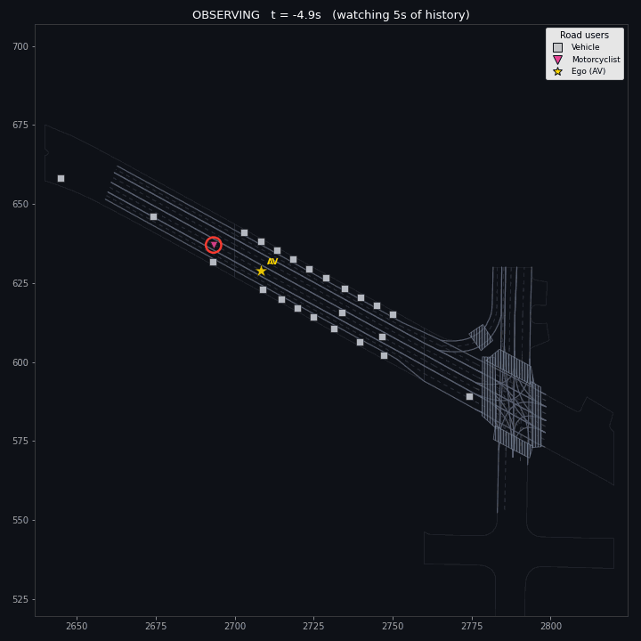
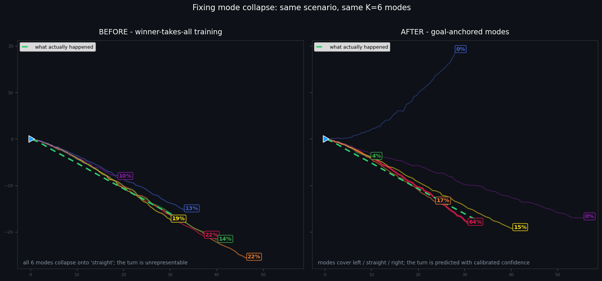
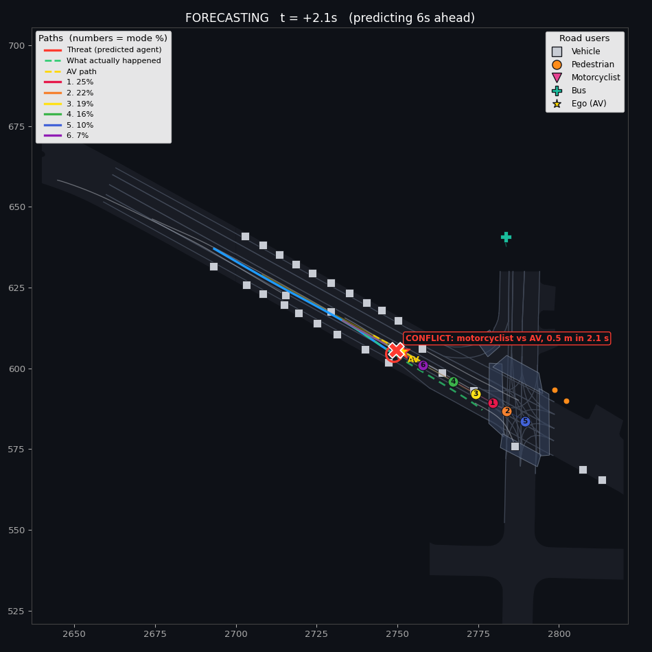
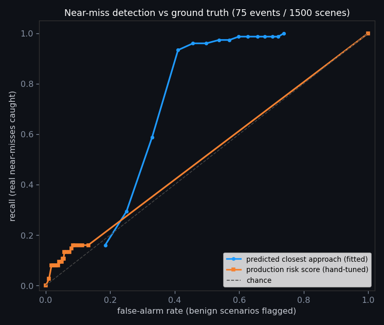

# Foresee

Trajectory forecasting and safety auditing on the Argoverse 2 self-driving dataset.

The model is a PyTorch transformer that predicts six possible 6-second futures, each with a
calibrated confidence, for a road user in a real driving scene. On top of it sits a safety
layer that turns those predictions into something a reviewer can act on: is the autonomous
vehicle in danger, from whom, and why. I validated the conflict taxonomy against real crash
data from NHTSA.



*A validation scenario from the bundled demo: a motorcyclist on a collision course with the AV.
The dashboard plays the scene frame by frame - predictions commit at t=0, the conflict is
flagged with a time-to-conflict, and the green dashed line shows what actually happened.*

## Why I built this

I got into robotics as a kid, and the part I always gravitated to was the autonomous routines -
getting the robot to make good decisions on its own was far more interesting to me than driving
it. Self-driving cars are that same problem at full scale, where the decisions actually matter,
and watching what companies are shipping today (and reading about what still goes wrong) made me
want to stop spectating and work through the problem end to end myself: train a forecaster on
real driving data, be critical about where it fails, and tie it back to the safety questions
real fleets face. This project is a learning exercise as much as a demo, and the parts I value
most are the ones where measuring something changed my mind.

```
                 the forecaster                          the safety layer
  ┌────────────────────────────────────────┐   ┌────────────────────────────────────┐
  │ AV2 parquet ─► agent-centric features  │   │ conflict risk  (TTC, threat, why)  │
  │ HD map      ─► lane tokens (PointNet)  │──►│ intent         (observed+predicted)│
  │ transformer decoder, K=6 goal-anchored │   │ precursors     (real crash setups) │
  │ modes + calibrated confidence          │   │ batch audit    (rank by risk)      │
  └────────────────────────────────────────┘   └────────────────────────────────────┘
                       validated against NHTSA Tesla crash data
```

## Fixing mode collapse

The model outputs K=6 trajectory modes so it can represent genuinely different outcomes
(turn left, go straight, stop). When I audited my first trained model, that wasn't what the
modes were doing: on 416 validation scenarios they averaged 1.44 distinct maneuvers - in 65%
of scenes all six were the same maneuver at slightly different speeds. The most-confident mode
was the correct one only 28% of the time, barely above the 17% you'd get by guessing.

The cause is winner-takes-all training: only the mode closest to ground truth gets a gradient,
so nothing stops the rest from drifting toward the most common behaviour. I tried an
endpoint-repulsion penalty first and it barely moved the number (1.44 to 1.50), which taught me
the constraint has to live in maneuver space, not in metres.

The fix that worked is goal-anchored modes. K representative 6-second endpoints are mined by
k-means over real training futures, stratified so the set always contains stop, left, right and
straight anchors. Each decoder query is conditioned on its anchor, and ground truth is assigned
to the nearest anchor rather than the nearest prediction, so every mode has to own its region
of outcomes. Confidences are temperature-calibrated on validation afterwards.



| Metric (416 real val scenarios) | WTA baseline | Goal-anchored |
|---|---:|---:|
| Distinct maneuvers among 6 modes | 1.44 | 2.5 - 2.6 |
| Top-1 mode-selection accuracy (random = 17%) | 28% | **63 - 66%** |
| Deployed ADE (commit to top mode) | 3.80 m | 3.23 m |
| Oracle minADE (best-of-6, needs the answer) | 1.39 m | 1.76 - 1.88 m |
| Calibration (stated 30-50% vs empirical) | ~29% at T=1.0 | 38% at T~1.9 |

Anchoring costs some oracle minADE, since each mode is constrained to its anchor region. I
think that's the right trade: oracle minADE is the metric you can only realise by already
knowing the future, and every number available at deployment improved. Any row reproduces
with one command:

```bash
python analysis/evaluate_modes.py --checkpoint runs_anchored/<ts>/best.pt
```

## The safety layer

- Conflict risk ([risk.py](src/foresee/risk.py)): probability-weighted risk of the predicted
  agent's futures intersecting the AV's path. A conflict has to be sustained and converging
  (one-frame clips and side-by-side driving don't count), and comes with a time-to-conflict,
  closest approach, the threat agent, and a reason in plain language ("changing lanes into
  the AV", "closing on the AV ahead").
- Intent, two ways: [intent.py](src/foresee/intent.py) reads what every vehicle is currently
  doing from its kinematics (braking, turning, lane-changing);
  [agent_intent.py](src/foresee/agent_intent.py) predicts intent by re-framing the scene
  around each nearby vehicle and re-running the forecaster.
- Precursor mining ([precursors.py](src/foresee/precursors.py)): scans normal driving for the
  setups of real crashes, e.g. the AV closing on a stopped lead without braking. Observed
  kinematics only.
- Batch audit ([audit.py](src/foresee/audit.py)): ranks an entire split by risk and writes a
  CSV, so reviewers see the risky few percent first.
- Dashboard ([dashboard/app.py](dashboard/app.py)): Streamlit app with the risk verdict,
  frame-by-frame playback against ground truth, intent read-outs, precursors and the audit
  table.



## Checking against real crashes (NHTSA)

US manufacturers have to report Level-2 driver-assist crashes to NHTSA under the Standing
General Order, and Tesla files 84% of those reports.
[analysis/nhtsa_insights.py](analysis/nhtsa_insights.py) pulls the public data and maps it
onto the same conflict taxonomy the model uses:

- The Tesla was the striking vehicle in about 76% of cases with a known impact point - the
  impacts are heavily front-biased, which points at forward perception/planning failures.
- About 85% of classifiable crashes fall into the two patterns Foresee flags: closing on a
  lead or fixed object (47%) and lane departure (38%). The taxonomy lines up with where the
  real crashes are.
- [analysis/mine_precursors.py](analysis/mine_precursors.py) then searches Argoverse for
  near-miss precursors of those crash types. Closing-type precursors show up at close to the
  real crash share (41% vs 47%), but lane-departure precursors don't show up at all (0% vs
  38%) - the Argoverse ego is a careful human driver who never leaves their lane. Naturalistic
  data simply can't surface that failure mode, which is worth knowing before you try to mine
  it.

Caveats: only 42% of Tesla reports have a classifiable pre-crash movement, so percentages are
over classifiable crashes; NHTSA publishes no mileage denominator, so this is crash
composition, not crash rate; Tesla redacts all narrative text. Details in
[INSIGHTS.md](INSIGHTS.md).

## Measuring the detector against ground truth

A screen is only as good as what it misses, so
[analysis/safety_scoreboard.py](analysis/safety_scoreboard.py) labels real near-miss events -
a converging approach to within 4 m centre-to-centre between two agents' actual futures -
across the full 1,500-scenario validation split, and scores the detector against them:

- 75 real focal-vs-ego near-misses exist (5% of scenarios). Another 441 involve non-focal
  agents, meaning **85% of real near-misses are invisible to a focal-only detector**. The
  single-agent limitation is a measured number now, not a guess.
- My hand-tuned risk gate caught 16% of the real events. The same predictions with a
  threshold fitted to ground truth (predicted closest approach under 4 m) catch **93% at a
  41% false-alarm rate** - usable as a screening tool that cuts review volume by roughly
  59% while keeping 93% of the danger. The signal was there; the hand-tuned gate was
  throwing it away.



The fitted operating point is reported rather than silently swapped into the product: the
dashboard's HIGH/MEDIUM verdicts stay precision-oriented alerts, and the fitted threshold is
the recall-oriented screening configuration for batch audits.

## Live demo

The repo bundles a trained checkpoint and 18 curated real scenarios under `demo/`, so the
dashboard runs with zero setup:

```bash
pip install -r requirements.txt
streamlit run dashboard/app.py     # picks up demo/ automatically
```

To host it on Streamlit Community Cloud: push to GitHub, go to share.streamlit.io, create a
new app pointing at branch `main` with main file `dashboard/app.py` (Python 3.11), deploy.

## Quickstart (full pipeline)

```bash
pip install -e . && pip install av2 streamlit pandas pyarrow

# real Argoverse 2 data (public S3 bucket, no account; Ctrl-C after a subset if you want)
bash scripts/download_av2.sh
export FORESEE_DATA_ROOT="$HOME/data/datasets/motion-forecasting"

python -m tests.smoke_test        # sanity check, no data needed

# train (about 20 min on an RTX 3080 for 8k scenarios)
python -m foresee.train --require-real-data --device cuda --arch anchored \
       --epochs 60 --batch-size 64 --hidden-dim 256

python analysis/evaluate_modes.py --checkpoint runs/<ts>/best.pt
python -m foresee.audit --checkpoint runs/<ts>/best.pt --limit 300
python analysis/nhtsa_insights.py
streamlit run dashboard/app.py
```

## Repository map

```
src/foresee/
├── data/            # AV2 parsing, agent-centric features, npz cache, synthetic fallback
├── models/          # lane_transformer (WTA baseline), anchored (goal-anchored, default)
├── anchors.py       # maneuver-stratified k-means goal anchors
├── losses.py        # anchor-assignment / WTA loss, Laplace NLL
├── train.py         # training loop + temperature calibration
├── risk.py          # conflict risk, reasons, per-mode descriptions
├── intent.py        # observed per-agent intent (kinematics)
├── agent_intent.py  # predicted per-agent intent (forecaster re-run per vehicle)
├── precursors.py    # near-miss detectors grounded in the crash data
└── audit.py         # batch risk ranking
analysis/            # evaluate_modes, nhtsa_insights, mine_precursors, safety_scoreboard
dashboard/app.py     # Streamlit UI
demo/                # trained checkpoint + 18 real scenarios for a zero-setup run
tests/               # unit tests + end-to-end smoke test
```

## Known limitations

The forecaster predicts one designated agent per scene, and the scoreboard shows 85% of real
near-misses involve other agents - jointly-consistent multi-agent prediction is the obvious
next step. Screening recall of 93% comes with a 41% false-alarm rate that a better model
should bring down. Perception is assumed perfect, since the pipeline consumes logged tracks.
The full list, with measurements, is in [DESIGN_REVIEW.md](DESIGN_REVIEW.md); the crash-data
analysis is in [INSIGHTS.md](INSIGHTS.md).
